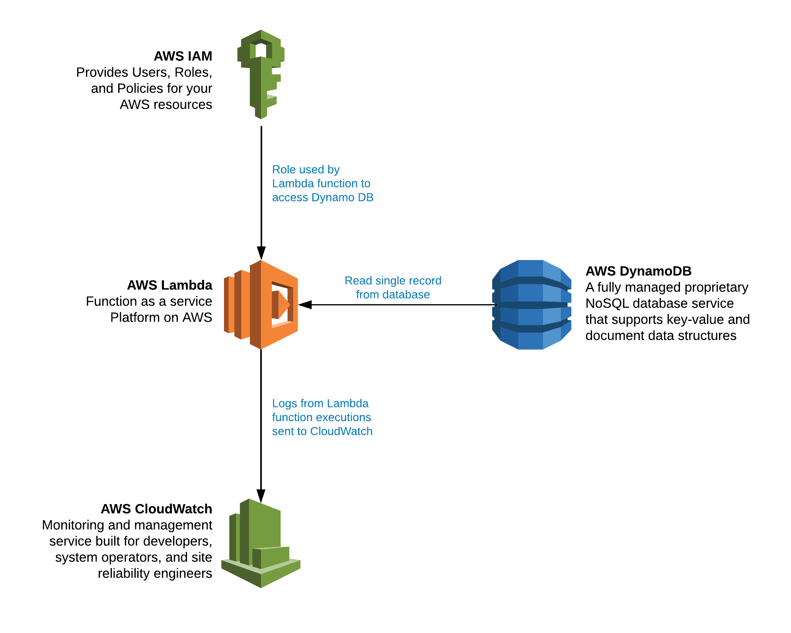

# Workshop: Lambda Functions 101

## Overview

This workshop is intended to take you on a short tour of making your first Lambda functions. You will
make two Lambda functions in this workshop. The first Lambda function will be a hello world function
to simply give you experience in creating and testing a Lambda Function. The second Lambda function
will read a single record from DynamoDB so that you can do something useful with Lambda other than
printing Hello World.

## What you are building

## How you will build it

*Section 1: Create an IAM role to be used with the two lambda functions that we will create in the Workshop*
* Create and IAM role
* Attach full access rights to DynamoDB

*Section 2: Create a Hello World Lambda Function*
* Use a blueprint Lambda function
* Create a test event
* Test the Lambda Function
* View the output/logs

*Section 3: Setting up DynamoDB with a single record*
* Create a DynamoDB table
* Add a single record to the DynamoDB Table

*Section 4: Using Lambda to retrieve data from DynamoDB*
* Create a blank Lambda using Nodejs
* Insert custom code to read from your DynamoDB table
* Create a test event
* Test your Lambda and view the output/logs

## Step-by-Step Instructions
Click [here](Workshop-Lambda101.pdf) for the pdf file of step-by-step instructions

